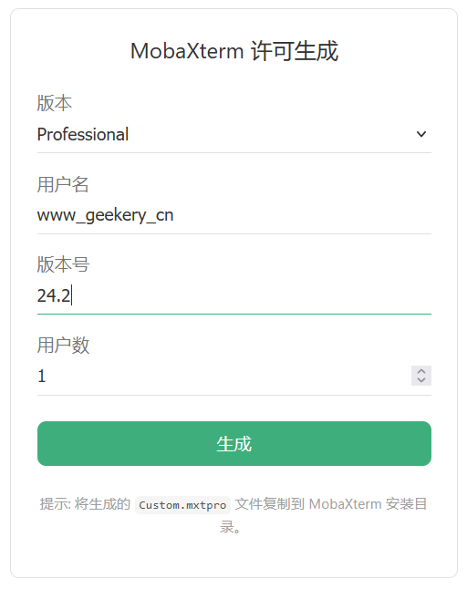

# vuepress-plugin-mobaxterm-cracker

一个为 VuePress 2设计的 MobaXterm 许可证生成器插件，它提供了一个开箱即用的 `<MobaXterm />` 组件。



## 🎨 使用教程

输入版本号等所需信息，点击生成按钮即可生成`Pro.key`，然后将生成的 `Custom.mxtpro` 文件复制到 MobaXterm 安装目录。

## 📦 安装

在你的 VuePress 2 项目中，使用 pnpm, yarn, 或者 npm 安装本插件：

```bash
# pnpm
pnpm add -D vuepress-plugin-mobaxterm-cracker

# yarn
yarn add -D vuepress-plugin-mobaxterm-cracker

# npm
npm install -D vuepress-plugin-mobaxterm-cracker
```

## 🚀 使用

在你的 VuePress 配置文件中引入插件：

```javascript
// .vuepress/config.js
import { defineUserConfig } from 'vuepress'
import { mobaxtermCrackerPlugin } from 'vuepress-plugin-mobaxterm-cracker'

export default defineUserConfig({
  // ...
  plugins: [
    mobaxtermCrackerPlugin(),
  ],
})
```

然后在你的任何 Markdown 文件中直接使用组件：

```markdown
<MobaXterm />
```

